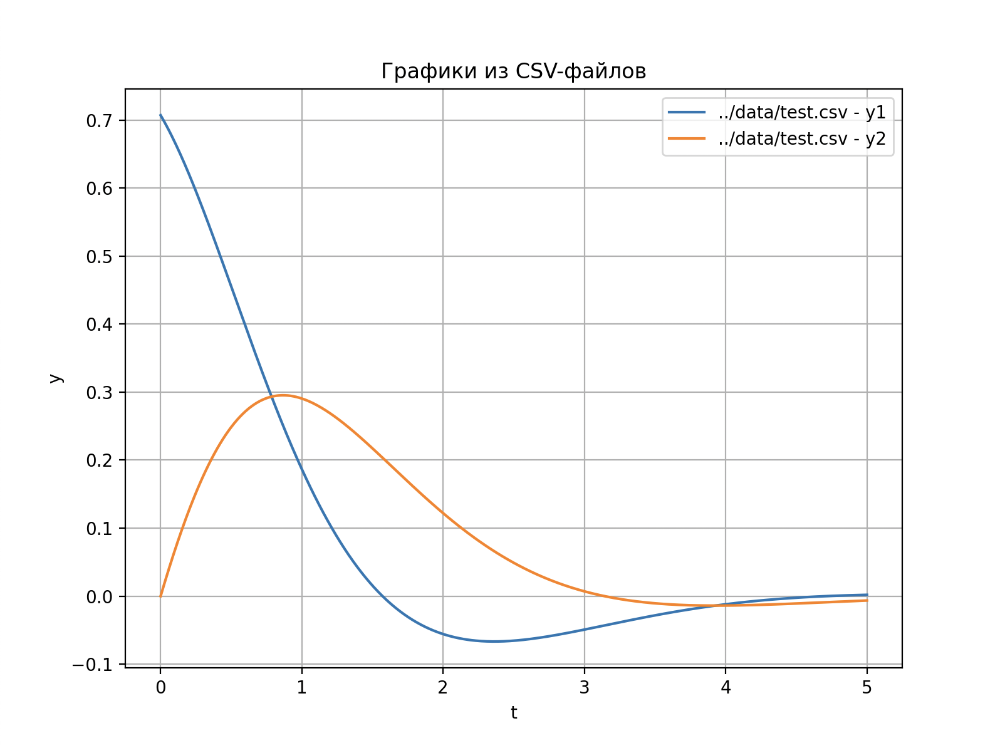

### Описание проекта для GitHub

# Ограниченная задача трёх тел — решение с использованием метода Рунге-Кутты 4-го порядка

Этот проект решает задачу трёх тел с использованием метода Рунге-Кутты 4-го порядка для численного интегрирования уравнений движения, моделируя орбиту Луны вокруг Земли. Также проект включает несколько Python-скриптов для визуализации и анимации траектории.

## Основные компоненты:

1. **C++ часть**:
   - Основная программа написана на C++ и использует метод Рунге-Кутты 4-го порядка для численного решения уравнений движения.
   - Программа моделирует движение Луны вокруг Земли в ограниченной задаче трёх тел, результат сохраняется в формате CSV.

2. **Python скрипты**:
   - **plot_orbit.py**: Рисует орбиту Луны, используя данные из CSV файла.
   - **plot_test.py**: Строит графики для тестовых данных, используемых в проекте.
   - **animate_orbit.py**: Анимирует движение объекта и вращение Луны, моделируя её орбиту и траекторию тела.
   
3. **Makefile**:
   - Интеграция C++ и Python частей проекта через Makefile, с автоматизацией сборки и выполнения.
   - Поддержка установки зависимостей Python с помощью `requirements.txt`.
   - Интегрированные команды для запуска программы, рисования графиков и анимации.

## Зависимости

1. C++:
   - g++ для компиляции программы.
   - Версия компилятора c++17.

2. Python:
   - Matplotlib для построения графиков и анимации.
   - Pandas для работы с данными из CSV.
   - Numpy для построения орбиты луны.

3. Установите Python зависимости:
   ```bash
   pip install -r requirements.txt
   ```

## Структура проекта

- `src/`: Исходный код на C++.
- `scripts/`: Python-скрипты для визуализации и анимации.
- `data/`: Данные, включая результаты симуляции и тестовые файлы.
- `requirements.txt`: Список зависимостей для Python.
- `ODESolver/`: Библиотека для решения систем однородных диференциальных уравнений.

## Использование

### 1. Сборка проекта:

Для сборки программы используйте команду:
```bash
make build
```

### 2. Запуск программы:

Запустите программу для вычислений:
```bash
make run
```

### 3. Рисование орбиты тела:

Для визуализации орбиты тела используйте команду:
```bash
make plot
```


### 4. Рисование графика для теста:

Для построения графика на основе тестовых данных:
```bash
make plot_test
```



### 5. Анимация движения тела:

Для анимации движения тела и вращения Луны:
```bash
make animate
```


### 6. Очистка:

Для очиститки собранных файлов:
```bash
make clean
```

## Примечания

- **Метод Рунге-Кутты** используется для численного решения системы обыкновенных дифференциальных уравнений.
- Орбита Луны моделируется с учетом ограничений трёх тел (Земля, Луна и тело).

## Лицензия  
MIT License. Используйте, модифицируйте, улучшайте! 🚀