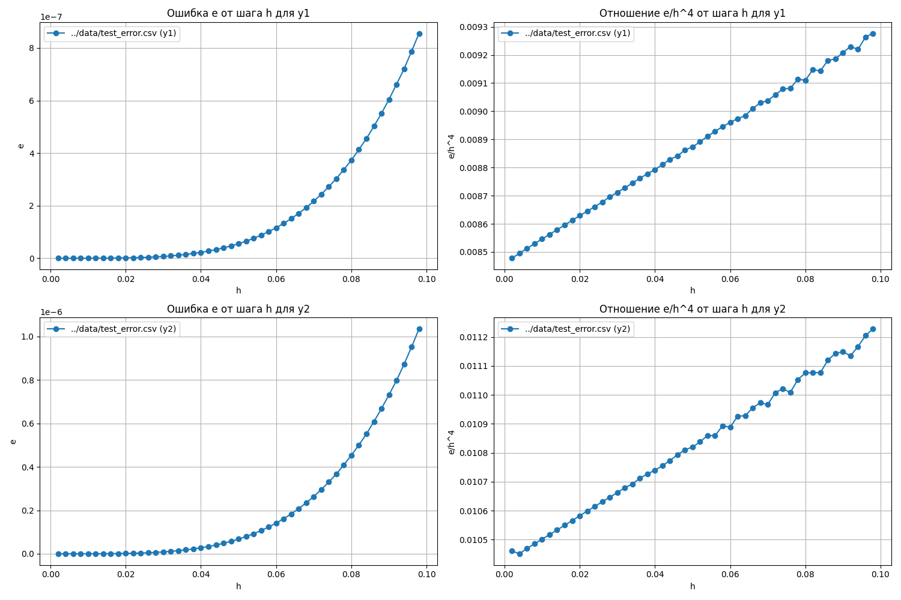
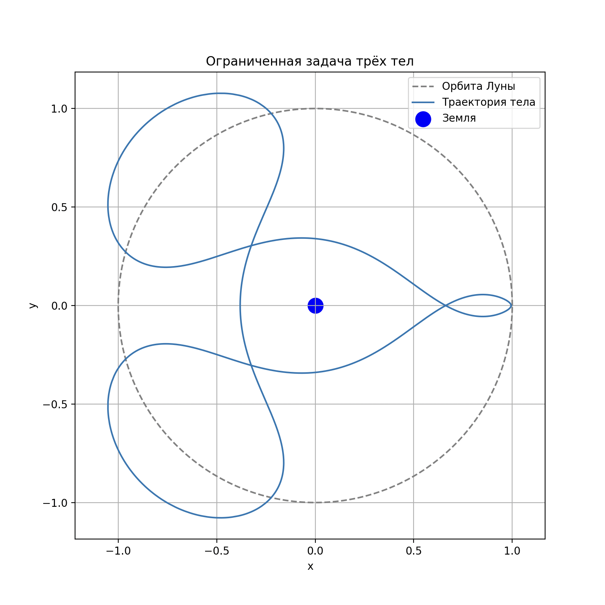
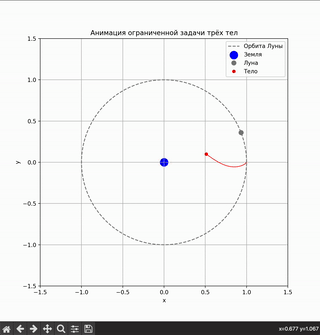

# Ограниченная задача трёх тел — решение с использованием метода Рунге-Кутты 4-го порядка

Этот проект решает задачу трёх тел с использованием метода Рунге-Кутты 4-го порядка для численного интегрирования уравнений движения, моделируя орбиту спутника вокруг Земли и Луны. Проект включает тестирование точности метода, анализ ошибок и инструменты для визуализации результатов.

## Основные компоненты:

1. **C++**:
   - Основная программа использует метод Рунге-Кутты 4-го порядка для решения уравнений движения.
   - Моделирование ограниченной задачи трёх тел (Земля, Луна, спутник) с сохранением результатов в CSV.
   - Тестовые программы для проверки точности метода и анализа ошибок.

2. **Python**:
   - **plot_orbit.py**: Визуализация орбиты спутника.
   - **plot_test.py**: Графики для тестовых данных (сравнение с аналитическим решением).
   - **plot_error.py**: Графики ошибок метода.
   - **animate_orbit.py**: Анимация движения спутника.

3. **Makefile**:
   - Автоматизация сборки, запуска и визуализации.
   - Установка зависимостей Python через `requirements.txt`.
   - Форматирование кода и проверка стиля.

## Зависимости

- **C++**:
  - Компилятор `g++` с поддержкой C++17.
  - Библиотека `ODESolver` (собирается автоматически).

- **Python**:
 - `matplotlib` (графики и анимация),
 - `pandas` (обработка данных),
 - `numpy` (численные вычисления).

## Структура проекта

```
.
├── ODESolver/        # Библиотека для решения ОДУ
├── bin/              # Исполняемые файлы
├── data/             # Результаты симуляций (CSV)
├── lib/              # Собранные библиотеки
├── scripts/          # Скрипты визуализации
├── src/              # Исходный код C++
├── test/             # Тесты и анализ ошибок
├── Makefile
├── README.md
└── requirements.txt
```

## Использование

### 1. Клонирование репозитория:
Для того, чтобы начать работать с проектом, сначала клонируйте репозиторий:
```bash
git clone https://github.com/LeonidMitrofanov/Three-Body_Problem
cd Three-Body_Problem/src
```

### 2. Установка зависимостей:
Для установки зависимостей Python используйте команду:
```bash
make req-install
```

### 3. Сборка проекта:
Для сборки программы используйте команду:
```bash
make build
```

### 4. Запуск вычислений:
Для запуска всех расчётов (основная задача, тесты, ошибки) используйте команду:
```bash
make calc_all
```
Для расчета конкретной задачи используйте команды:

Основная задача (орбита спутника):
```bash
make calc
```
Тестовая задача:
```bash
make calc_test
```
Вычисление ошибок метода Рунге-Кутты 4-го порядка:
```bash
make calc_error
```
### 5. Визуализация:
Для построения графика на основе тестовых данных:
```bash
make plot_error
```


### 6. Рисование орбиты тела:

Для визуализации орбиты спутника используйте команду:
```bash
make plot
```


Для построения графика ошибки вычислений на тестовых данных:
```bash
make plot_error
```


Для визуализации орбиты спутника используйте команду:
```bash
make plot
```


Для анимации движения спутника:
```bash
make animation
```



### 7. Очистка:
Для удаление скомпилированных файлов и данных используйте:
```bash
make clean
```

### Дополнительные команды:
Форматирование кода (clang-format)
```bash
make format
```
Проверка стиля кода
```bash
make check-style
```

## Лицензия  
MIT License. Используйте, модифицируйте, улучшайте! 🚀
